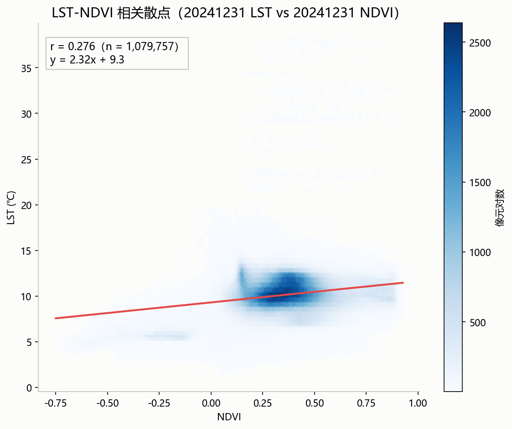
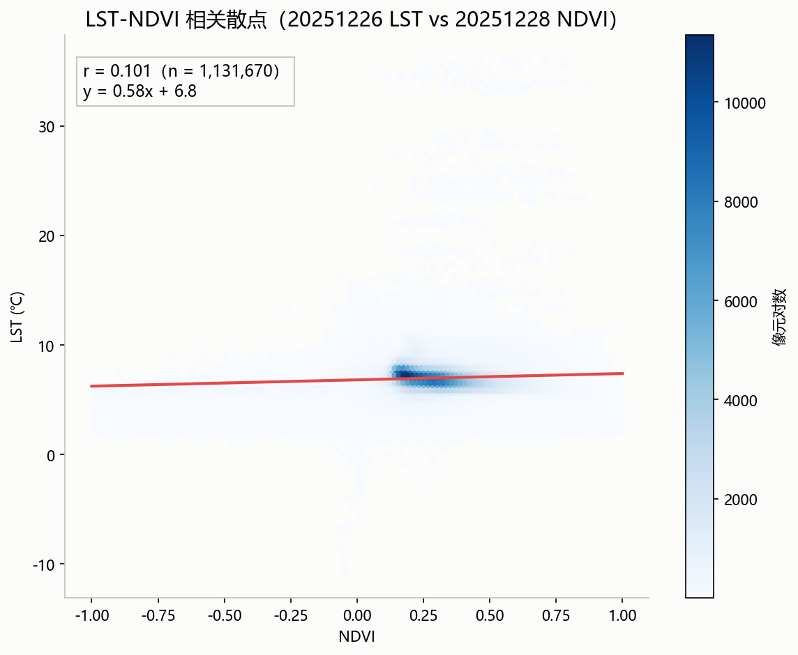

# Remote Sensing × LLM Tool Use

A hands-on exploration of using LLM Function Calling to drive
real-world remote sensing processing workflows.

**基于真实遥感处理流程的 LLM Tool Use 实践项目。**

项目以本人此前参与研发的生态遥感产品流程为基础，将部分数据处理、反演、
统计和分析能力封装为 LLM 可调用工具，探索自然语言驱动遥感处理流程的实现方式。

核心链路：**自然语言问题 → LLM 生成 Tool Call → 真实遥感处理（SNAP / GDAL / 自研算法）→ 结果验证 → 中文解读**

## Motivation

我此前主要从事生态遥感产品研发，长期处理 Sentinel、Landsat、Himawari、ERA5
等多源数据，并参与数据预处理、反演建模、产品验证和自动化生产。

离开原岗位后，我开始学习 LLM 应用开发。为了避免从一个与自身背景无关的
AI Demo 开始，我选择将此前接触过的真实遥感处理流程作为学习材料：
重新梳理旧脚本，拆分独立功能，并尝试通过 Function Calling 将这些能力暴露给 LLM。

因此，本项目更准确地说是一次：

> Real-world Remote Sensing Pipelines × LLM Tool Use

的个人学习与工程实践，而不是一个成熟的通用 Agent 平台。

## Learning Path

1. **Remote Sensing Workflows** —— 复现既有遥感处理流程，理解输入、输出及处理依赖
2. **LLM API** —— 学习模型调用、Prompt 与结构化输出
3. **Function Calling** —— 定义 Tool schema，描述工具参数和返回结果
4. **Remote Sensing Toolization** —— 将已有遥感函数封装为可调用工具，建立工具级验证
5. **Multi-tool Workflow** —— 尝试让 LLM 根据自然语言任务调用多个工具，探索 Tool granularity 与调用顺序
6. **Validation** —— 建立逐像素回归与数据类型 / CRS / 数值范围检查，累计 300+ assertions
7. **Next Step** —— Agent architecture、Evaluation、Error recovery、Observability、Deployment

## How Tool Use Works

用户输入自然语言任务后：

1. 将可用工具名称、描述和参数 schema 提供给 LLM
2. LLM 根据任务生成结构化 tool call
3. 本地程序执行对应遥感函数
4. 将工具结果返回给 LLM
5. LLM 根据结果决定是否继续调用其他工具
6. 最终生成结构化结果与中文解释

需要注意的是：本项目中的 “Agent” 主要指基于 LLM Function Calling 的多工具调用
流程，并非复杂的自主规划或通用 Agent Framework。

## Why 48 Tools?

48 并不是经过系统实验得到的最优 Tool 数量，它主要来自对既有遥感处理流程进行
功能拆分后的结果。

拆分时主要考虑：

- 输入输出是否明确
- 是否能够独立运行
- 是否能够独立验证
- 是否具有相对独立的业务含义

因此，这个数字更多反映了当前项目的工具化粒度，而不是 Agent 架构设计的理论结论。

后续将继续探索：Tool granularity、Workflow vs Agent、Tool selection、Tool dependency。

## Architecture

```text
User Query
    |
    v
LLM / DeepSeek API
    |
    | Function Calling
    v
Remote Sensing Tool Registry
    |
    +---- GDAL / Rasterio
    |
    +---- SNAP
    |
    +---- ML Models
    |
    v
Output / Metrics
    |
    v
LLM Explanation
```

## 产品线

| 产品 | 目录 | 工具数 | 验证 | 能力 |
|---|---|---|---|---|
| NDVI + LST 双域联合 Agent | `ndvi_agent/` | 14 | LST 52 · NDVI 83 项断言 | Sentinel-2 / Landsat 8/9；SNAP 预处理→去云→镶嵌→裁剪→统计→变化检测；Landsat TIRS LST 反演 / ΔLST 对比 / LST-NDVI 联合分析（含跨年同季节对照） |
| 森林火点识别（Himawari 静止卫星） | `fire_agent/` | 5 | 86 项断言 | Himawari-8/9；10 分钟级观测；发现→提取→云掩膜→上下文火点识别→统计 |
| 土壤相对湿度（S1+S2 双星协同 RF） | `soil_agent/` | 9 | 33+24 项断言 | Sentinel-1 + Sentinel-2 双星协同；S1/S2 特征→随机森林训练→反演→模型质量自动评估 |
| PM10(2.5) 反演（多源特征） | `pm_agent/` | 10 | 34 项断言 | Himawari + ERA5 + 站点观测；AOD/ERA5 提取→站点观测校正→基于垂直廓线推算不同高度的浓度分布 |
| 水体总磷（S2+S3 双传感器） | `pwater_agent/` | 10 | 103 项断言 | Sentinel-2 + Sentinel-3；时空匹配→SNAP 预处理链→6 波段组合指数→RF 反演 |

## 成果展示

图件来源标签：

- 〔Original Business Output〕：在职期间业务产品 / 产品手册中的原始成果图
- 〔Generated by This Project〕：本项目重新运行工具链生成的结果（未做后期修饰）

| 产品 | 成果图 | 验证 | 来源 |
|---|---|---|---|
| NDVI 反演（单景） |  | 23+29+31 项断言 | Original Business Output |
| 地表温度 LST（Landsat TIRS，单景反演） |  | 23+17+12 项断言 | Original Business Output |
| 森林火点识别 |  | 86 项断言 | Original Business Output |
| 土壤相对湿度 |  | 33+24 项断言 | Original Business Output |
| PM10(2.5) 反演 |   | 34 项断言 | Original Business Output |
| 水体总磷 |  | 103 项断言 | Original Business Output |

## 反演流程图

（均为产品手册原图，Original Business Output）

| 产品 | 流程图 |
|---|---|
| 土壤相对湿度（Sentinel-1 雷达 + Sentinel-2 光学融合反演） |  |
| PM10/2.5（多源特征反演 + 空值填补） |  |
| 水体总磷（Sentinel-2 + Sentinel-3 随机森林反演） |  |

## 多时相对比与联合分析成果

跨年同季节对照（同一研究区），对应 `compare_ndvi_dates`、LST 对比与
LST-NDVI 联合分析工具的真实运行产物，全部为 Generated by This Project：

| 产品 | 对比/分析图 | 说明 |
|---|---|---|
| NDVI 变化对比 |   | 20250425 → 20260510：Δ=晚-早 分类（改善/稳定/退化/无效）与各类面积占比 |
| LST 变化对比 |   | 20241231 → 20251226：ΔLST 变化分类与各类面积占比 |
| LST-NDVI 联合分析 |   | 近似同期 LST-NDVI 散点与相关性，两年对照看关系年际稳定性 |

## PM10(2.5) 反演验证结果

留一法站点验证（业务产品时期的验证结果，Original Business Output）：
每次去掉一个监测站重新建模，在该站位置预测并与实测对比：

| 监测点编码 | 城市 | 监测值（μg/m³） | 验证模型结果¹（μg/m³） | 误差（μg/m³） | 相对误差（%） |
|---|---|---|---|---|---|
| 1104A | 沈阳 | 83.0 | 80.37 | +2.63 | 3.17 |
| 1317A | 郑州 | 109.0 | 102.58 | +6.42 | 5.89 |
| 1465A | 西安 | 98.0 | 105.20 | -7.20 | 7.35 |
| 2405A | 南阳 | 92.0 | 100.05 | -8.05 | 8.75 |
| 3005A | 徐州 | 54.0 | 66.15 | -12.15 | 22.52 |
| 3635A | 洛阳 | 138.0 | 118.01 | +19.99 | 14.48 |

**六站点平均 MAE 9.4 μg/m³，平均相对误差 10.4%。**

¹ 验证模型结果为去掉该监测站重新建立模型在该监测站处得到的结果，用来评估模型准确度

## Legacy Reproduction & Correction

在重新理解历史遥感脚本并进行 Tool 化的过程中，对部分实现行为进行了复现和检查。
为避免 “修正后无法复现历史结果”，项目保留两种处理模式：

- `legacy`：尽可能复现历史脚本的原始行为，用于结果回归与兼容
- `correct`：对复现过程中确认的实现问题进行修正后的行为

这样做的目的不是简单 “重写旧代码”，而是在 复现历史结果 → 理解原始实现 →
识别实现异常 → 记录修正 → 回归验证 之间建立清晰的工程链路。

复现过程中确认并修正的实现问题（非原产品科学精度问题）：

| 产品 | 复现过程中确认的实现问题 |
|---|---|
| 森林火点 | 量纲错误 |
| 土壤相对湿度 | 特征列错位、无地理重投影、垃圾文件 |
| PM10(2.5) | RF 预测列序、AOD 双倍缩放、命名交叉 |
| 水体总磷 | 掩膜坏值入模、阈值 0、÷0 语义、模型未落盘等 6 项 |

## Validation

当前包含 6 套验证脚本（`verify_*.py`）和 300+ assertions，主要覆盖：

- Raster shape / dtype / CRS / geotransform / NoData
- value range
- pixel-level numerical consistency
- expected output existence
- abnormal output detection

对于能够复现的历史业务产品，使用逐像素回归比较重建结果。

注意：工程回归验证证明的是流程 / 实现的一致性，不等同于对遥感反演模型
科学精度的独立验证（reproduction accuracy ≠ scientific accuracy）。

## Data & Reproducibility

不同产品的数据条件并不完全相同：

| 产品 | 数据情况 |
|---|---|
| NDVI / LST | 真实遥感数据 / 历史业务结果 |
| Fire | 真实遥感数据，独立精度验证有限 |
| Soil | 部分模拟数据 |
| PM | 部分模拟数据 / 有限站点验证 |
| Water TP | 有限实测样本 |

- 影像与产物为本地数据资产，未随仓库发布；验证脚本依赖的数据路径在各脚本
  顶部常量区声明，运行前需自备对应数据（哨兵 2 .SAFE.zip、Landsat L2SP、
  Himawari NC、站点实测 CSV、SNAP 图资产等）
- 图件来源按〔Original Business Output〕/〔Generated by This Project〕区分，
  不混为一谈

## Limitations

- 部分产品使用模拟训练/测试数据（土壤湿度样本为随机模拟数据，PM 预报数据为模拟数据）
- 水体总磷可用实测样本有限（建模样本 45 个、3 站有效，测试 R² 仅作机械对照）
- 火点识别阈值由人工对照 NASA FIRMS 调参确定，缺乏独立标注数据上的识别精度评估
- LST 云掩膜为启发式实现，可能残留薄云 / 漏检云影
- LST-NDVI 关系分析目前以相关性探索为主，存在物候差，不推断因果
- 当前 Agent 主要基于 Function Calling
- 尚未实现复杂 Planner、Memory 或 Multi-Agent 架构
- Tool 数量和粒度尚未经过系统实验优化

## Next Steps

下一阶段计划重点学习：

- Agent loop 与状态管理
- Workflow vs Agent 与 Tool granularity
- Tool selection / Agent evaluation
- Error recovery 与长任务管理
- Observability
- Docker / API 服务与 Web UI（工程部署方向）

## Tech Stack

### Remote Sensing

- ESA SNAP 13（GraphBuilder 构建处理图 → 导出 XML → `gpt.exe` 命令行调用）
- GDAL 3.6.2 / Rasterio / xarray / GeoPandas
- Python 3.9

### Machine Learning

- scikit-learn（Random Forest / XGBoost）
- 特征筛选、残差校正、留一站点交叉验证

### LLM

- DeepSeek API / OpenAI API
- Function Calling / Tool Use

### Engineering

- Python 自动化流水线：Python 批量生成 gpt 命令并运行，环境配置后可脱离
  SNAP 界面由脚本控制
- Git / GitHub
- Regression Testing（`verify_*.py`，幂等：产物已存在时短路跳过）

## 目录结构

```text
rs-agent-portfolio/
├── ndvi_agent/       # NDVI + LST 双域联合（14 工具 + 验证 + 跨年对照）
├── fire_agent/       # 火点识别（5 工具 + 86 项断言验证）
├── soil_agent/       # 土壤相对湿度（9 工具 + 验证 + SNAP 图资产）
├── pm_agent/         # PM10(2.5) 反演（10 工具 + 验证）
├── pwater_agent/     # 水体总磷（10 工具 + 验证 + SNAP 图资产）
└── portfolio/        # 成果图、流程图与报告输出
```

## 运行与验证

每个产品目录的 `verify_*.py` 为全量验证脚本：

```bash
PYTHONUTF8=1 python ndvi_agent/verify_lst_tools.py
PYTHONUTF8=1 python ndvi_agent/verify_crossyear.py
PYTHONUTF8=1 python fire_agent/verify_fire_tools.py
PYTHONUTF8=1 python soil_agent/verify_soil_tools.py
PYTHONUTF8=1 python pm_agent/verify_pm_tools.py
PYTHONUTF8=1 python pwater_agent/verify_pw_tools.py
```

Agent 交互（把问题写进 UTF-8 文本文件，规避命令行中文编码问题；需要 API key）：

```bash
PYTHONUTF8=1 python ndvi_agent/ask_rs_agent.py question.txt
```

Windows 运行注意：需 `PYTHONUTF8=1`（中文路径与输出的编码）；建议使用 conda
虚拟环境的 python 全路径运行，避免裸 `python` 命中商店占位程序。

Agent 纪律：同一工具连续失败 3 次即停止并如实说明原因。
